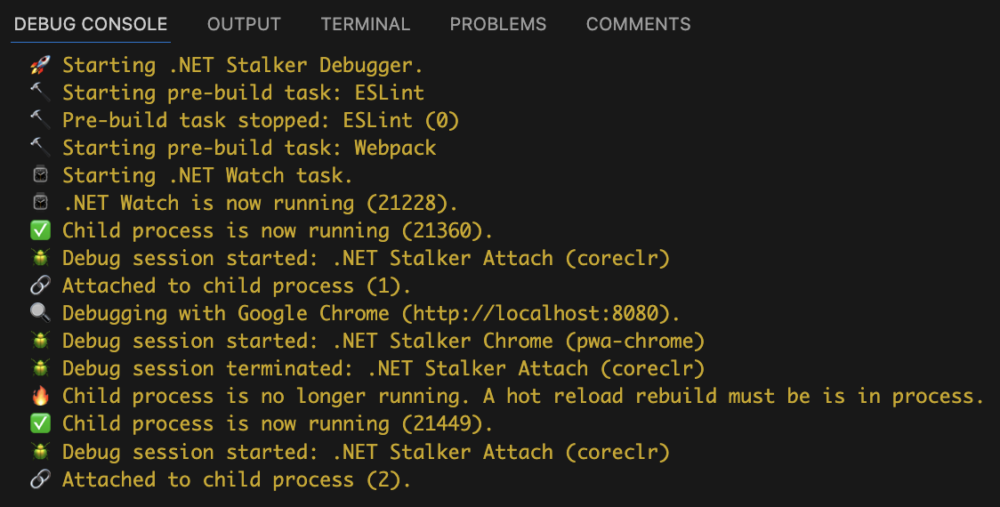
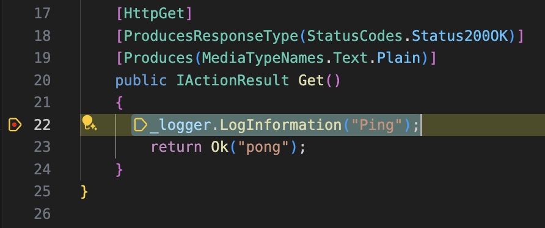
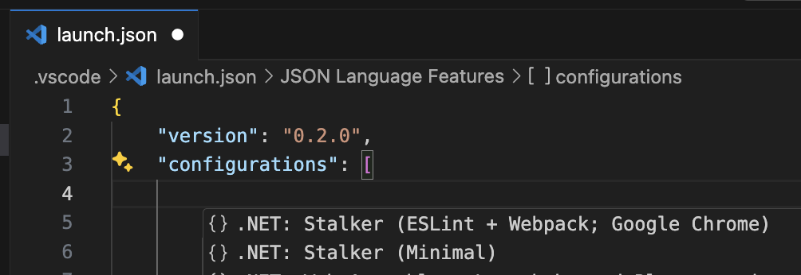
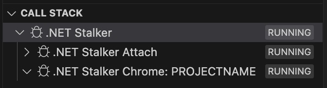
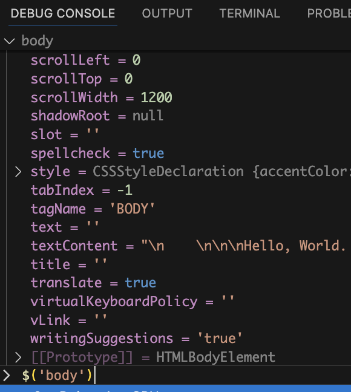

<p align="center">🚧 This extension is in early development. Please report any issues. 🚧</p>

<p align="center" style="margin:20px 0 0 0;font-weight:bold;font-size:1.5em">.NET Stalker Debugger</p>
<p align="center" style="margin:0 0 0 0;font-weight:bold;font-size:1.25em">3-in-1 ASP.NET (5+ and Core) debugger for Visual Studio Code</p>
<p align="center" style="margin:0 0 20px 0;">(Replaces default debugger in launch configurations in <code>launch.json</code>)</p>

# .NET Stalker Debugger

### 🛠️ Typical Dev Stack

Full-stack development. Backend of a C# ASP.NET Web App/API project and front-end client-side HTML, CSS, JavaScript (transpiled from TypeScript), etc.

### 🔥 Active Hot Reloads and Transpiles

Actively "hot reload" backend changes and "hot transpile" front-end changes (TypeScript to JavaScript).

### 🪲 Dual-Debugging

Debugging of backend and front-end (using Google Chrome's developer tool) both within Visual Studio Code simultaneously.

### 🚀 Continuous Re-Attaching

Automatically re-attaches to the project's new process (on "hot reload" builds).

<p align="center" style="font-size:1.25em">🚫 No need to manually stop, re-attach or restart debuggers or run multiple tasks 🚫</p>
<p align="center" style="font-size:1.25em">🎉 All in a single debug session within Visual Studio Code 🎉</p>

<p align="center">
<br/>
<span style="font-size:.85em">.NET Stalker Debugger: VS Code debug console output</span>
</p>

<p align="center">
<br/>
<span style="font-size:.85em">Backend: C#/.NET breakpoint in VS Code</span>
</p>

<p align="center">
<br/>
<span style="font-size:.85em">Front-end: TypeScript breakpoint in VS Code (though running transpiled as JavaScript on client-side)</span>
</p>

<p align="center">
<br/>
<span style="font-size:.85em">Launch configuration snippets available in <code>launch.json</code></span>
</p>

# Table of Contents

-   [Primary Three Features](#primary-three-features)
    -   [Phases and Tooling](#phases-and-tooling)
-   [Requirements](#requirements)
-   [Launch Configurations](#launch-configurations)
    -   [Properties](#properties)
    -   [Examples](#examples)
-   [Client-Side JavaScript/TypeScript Debugging](#client-side-javascripttypescript-debugging)
    -   [Google Chrome](#google-chrome)
    -   [Node.js](#nodejs)
    -   [Node Package Dependencies](#node-package-dependencies)
    -   [TypeScript, ESLint and Webpack Configuration Files](#typescript-eslint-and-webpack-configuration-files)
    -   [Launch Configuration Modifications](#launch-configuration-modifications)
-   [Extension Settings](#extension-settings)
-   [Known Issues](#known-issues)
-   [Release Notes / Changelog](#release-notes--changelog)

# Primary Three Features

The three primary features of .NET Stalker Debugger.

1. 🛠️ <b>BUILD</b> — Build and run project
    - Lint JavaScript and TypeScript files
    - Transpile TypeScript to JavaScript for client-side use
    - Build and run the .NET project
2. 🪲 <b>DEBUG</b> — Debug both backend and front-end
    - Attach to the .NET project process for backend debugging
    - Debug with Google Chrome's developer tools for client-side debugging
3. ⌚️ <b>WATCH</b> — Watch for changes
    - Watch TypeScript files to "hot transpile" to JavaScript when needed
    - Watch .NET project files to perform "hot reloads" when possible
    - Rebuild and re-attach to project's new process when a "hot reload" build is needed

## Phases and Tooling

Logical order of phases within the three primary features.

| #   | Phase     | Feature | Tooling | Description                                                                        |
| --- | --------- | ------- | ------- | ---------------------------------------------------------------------------------- |
| 1   | PreBuild  | 🛠️      | eslint  | Lint JavaScript and TypeScript files                                               |
| 2   | PreBuild  | 🛠️      | webpack | Transpile TypeScript to JavaScript for client-side use                             |
| 3   | Continual | ⌚️     | webpack | Watch TypeScript files to "hot transpile" to JavaScript when needed                |
| 4   | Build     | 🛠️      | dotnet  | Build and run the .NET project                                                     |
| 5   | Debug     | 🪲      | vscode  | Attach to the .NET project process for backend debugging                           |
| 6   | Debug     | 🪲      | chrome  | Debug with Google Chrome's developer tools for client-side debugging               |
| 7   | Continual | ⌚️     | dotnet  | Watch .NET project files to perform "hot reloads" when possible                    |
| 8   | On-Demand | ⌚️     | vscode  | Rebuild and re-attach to project's new process when a "hot reload" build is needed |

## Misc Screen Shots

<p align="center">
<br/>
<span style="font-size:.85em">.NET Stalker Debugger: VS Code debugger call stack</span>
</p>

<p align="center">
<br/>
<span style="font-size:.85em">JavaScript/TypeScript debug console in VS Code</span>
</p>

# Requirements

-   macOS, possibly Linux (not yet Windows)
-   .NET SDK 6.0 or later
-   Visual Studio Code 1.80.0 or later
-   Visual Studio Code extensions [C#](https://marketplace.visualstudio.com/items?itemName=ms-dotnettools.csharp) and [C# Dev Kit](https://marketplace.visualstudio.com/items?itemName=ms-dotnettools.csdevkit)
-   Google Chrome
-   Node.js

# Launch Configurations

## Properties

| Property         | Type          | Description                                                                                                                                                                                                                       | Required | Default                 | Defined Values |
| ---------------- | ------------- | --------------------------------------------------------------------------------------------------------------------------------------------------------------------------------------------------------------------------------- | -------- | ----------------------- | -------------- |
| `name`           | `string`      | Name of the launch configuration.                                                                                                                                                                                                 | Yes      |                         |                |
| `type`           | `string`      | Type of the launch configuration. Must be `stalker`.                                                                                                                                                                              | Yes      |                         |                |
| `request`        | `string`      | Request type of the launch configuration. Must be `launch`.                                                                                                                                                                       | Yes      |                         |                |
| `project`        | `string`      | Path to the project file (`.csproj`).                                                                                                                                                                                             | Yes      |                         |                |
| `process`        | `string`      | Path to the project's executable process.                                                                                                                                                                                         | Yes      |                         |                |
| `cwd`            | `string`      | Current working directory.                                                                                                                                                                                                        |          | `${workspaceFolder}`    |                |
| `url`            | `string`      | URL of the project.                                                                                                                                                                                                               |          | `http://localhost:5000` |                |
| `env`            | `{[key]:any}` | Environment variables.                                                                                                                                                                                                            |          | `{}`                    |                |
| `webRoot`        | `string`      | Path to the web root of the project (if debugging with Google Chrome).                                                                                                                                                            |          | `${workspaceFolder}`    |                |
| `vars`           | `{[key]:any}` | Launch configuration variables. For use with other launch configuration properties. Reference only VSCode variables; do not reference other launch configuration variables. Not used directly by the extension for functionality. |          |                         |                |
| `attachOptions`  | see below     | Options for attaching to child process started by .NET Watch.                                                                                                                                                                     |          | `{}`                    |                |
| `buildOptions`   | see below     | Options relating to building.                                                                                                                                                                                                     |          | `{}`                    |                |
| `processOptions` | see below     | Options for child process started by .NET Watch.                                                                                                                                                                                  |          | `{}`                    |                |
| `watchOptions`   | see below     | Options for .NET Watch.                                                                                                                                                                                                           |          | `{}`                    |                |

### Type `attachOptions` Properties

Options for attaching to child process started by .NET Watch.

| Property         | Type          | Description                                                                                                                    | Required | Default                              | Defined Values                                 |
| ---------------- | ------------- | ------------------------------------------------------------------------------------------------------------------------------ | -------- | ------------------------------------ | ---------------------------------------------- |
| `action`         | `string`      | Action to take when the child process is initially attached to.                                                                |          | `openExternally`                     | `nothing`, `openExternally`, `debugWithChrome` |
| `interval`       | `number`      | Interval in milliseconds to attempt to re-attach to the process after a full hot load build (as well as initially at startup). |          | `500`                                |                                                |
| `taskProperties` | `{[key]:any}` | Properties for internal the Visual Studio Code attach task.                                                                    |          | `{ logging: { moduleLoad: false } }` |                                                |

### Type `buildOptions` Properties

Options relating to building.

| Property        | Type      | Description                                                                                                                                                                                                                                                                  | Required | Default | Defined Values |
| --------------- | --------- | ---------------------------------------------------------------------------------------------------------------------------------------------------------------------------------------------------------------------------------------------------------------------------- | -------- | ------- | -------------- |
| `preBuildTasks` | see below | Tasks to run before running .NET Watch (which builds and runs the project). Tasks are run in order. By default, tasks are not treated as background tasks and are waited for before continuing. Use `isBackground` and `waitFor` change behavior. Default is an empty array. |          | `[]`    |                |

### Type `preBuildTask` Properties

| Property                | Type      | Description                                                              | Required | Default | Defined Values |
| ----------------------- | --------- | ------------------------------------------------------------------------ | -------- | ------- | -------------- |
| `name`                  | `string`  | Name of the task to run.                                                 | Yes      |         |                |
| `commandLine`           | `string`  | Command line to run.                                                     | Yes      |         |                |
| `isBackground`          | `boolean` | Indicate whether the task is a background task or not.                   |          | `false` |                |
| `waitFor`               | `boolean` | Indicate whether to wait for the task to complete before continuing.     |          | `true`  |                |
| `failOnNonZeroExitCode` | `boolean` | Indicate whether to fail the build if the task has a non-zero exit code. |          | `false` |                |

### Type `processOptions` Properties

Options for child process started by .NET Watch.

| Property        | Type     | Description                                                                                                                   | Required | Default | Defined Values |
| --------------- | -------- | ----------------------------------------------------------------------------------------------------------------------------- | -------- | ------- | -------------- |
| `args`          | `array`  | Arguments passed to the child process.                                                                                        |          | `[]`    |                |
| `launchProfile` | `string` | Launch profile (in `Properties/launchSettings.json`) to start the child process with. If used, the `url` property is ignored. |          |         |                |

### Type `watchOptions` Properties

Options for .NET Watch.

| Property                | Type      | Description                                                                                                                                                       | Required | Default  | Defined Values |
| ----------------------- | --------- | ----------------------------------------------------------------------------------------------------------------------------------------------------------------- | -------- | -------- | -------------- |
| `args`                  | `array`   | Arguments passed to .NET Watch.                                                                                                                                   |          | `[]`     |                |
| `disableOptimizations`  | `boolean` | Disable MSBuild optimizations.                                                                                                                                    |          | `false`  |                |
| `doNotLaunchBrowser`    | `boolean` | Do not launch the browser if the `processOptions.launchProfile` property is used and is configured to do so. Ignored if `processOptions.action` is not `nothing`. |          | `false`  |                |
| `doNotRefreshBrowser`   | `boolean` | "Do not refresh the browser when changes are detected.                                                                                                            |          | `false`  |                |
| `dotnet`                | `string`  | Path to the dotnet executable.                                                                                                                                    |          | `dotnet` |                |
| `interval`              | `number`  | Interval in milliseconds to check if child process has restarted, after a hot load build, to re-attach to it.                                                     |          | `1000`   |                |
| `noEmojis`              | `boolean` | Disable emojis in the console output.                                                                                                                             |          | `false`  |                |
| `usePollingFileWatcher` | `boolean` | Use polling file watcher. This is required for some file systems, such as network shares, Docker mounted volumes, and other virtual file systems.                 |          | `false`  |                |
| `verbose`               | `boolean` | Enable verbose logging for .NET Watch.                                                                                                                            |          | `false`  |                |

If the browser is not refreshing on detected changes, see the `usePollingFileWatcher` property and [dotnet-watch browser refresh](https://learn.microsoft.com/en-us/aspnet/core/tutorials/dotnet-watch#browser-refresh).

See [dotnet-watch configuration](https://learn.microsoft.com/en-us/aspnet/core/tutorials/dotnet-watch#dotnet-watch-configuration) for more information on some of these watch options.

## Examples

### Minimum launch configuration

```json
{
    "name": ".NET Stalker",
    "type": "stalker",
    "request": "launch",
    "project": "${workspaceFolder}/src/MyWebApp/MyWebApp.csproj",
    "process": "${workspaceFolder}/src/MyWebApp/bin/Debug/net8.0/MyWebApp",
    "cwd": "${workspaceFolder}/src/MyWebApp",
    "env": {
        "ASPNETCORE_ENVIRONMENT": "Development"
    }
}
```

### Minimum launch configuration with specific URL and use of variables

```json
{
    "name": ".NET Stalker",
    "type": "stalker",
    "request": "launch",
    "vars": {
        "framework": "net8.0",
        "projectDir": "${workspaceFolder}/src/${var:projectName}",
        "projectName": "MyWebApp"
    },
    "project": "${var:projectDir}/${var:projectName}.csproj",
    "process": "${var:projectDir}/bin/Debug/${var:framework}/${var:projectName}",
    "cwd": "${var:projectDir}",
    "url": "http://localhost:8080",
    "env": {
        "ASPNETCORE_ENVIRONMENT": "Development"
    }
}
```

### Full launch configuration with ESLint, Webpack (watch mode) and Google Chrome client-side debugging

```json
{
    "name": ".NET Stalker (Full)",
    "type": "stalker",
    "request": "launch",
    "vars": {
        "framework": "net8.0",
        "projectDir": "${workspaceFolder}/src/${var:projectName}",
        "projectName": "<PROJECTNAME>"
    },
    "project": "${var:projectDir}/${var:projectName}.csproj",
    "process": "${var:projectDir}/bin/Debug/${var:framework}/${var:projectName}",
    "cwd": "${var:projectDir}",
    "env": {
        "ASPNETCORE_ENVIRONMENT": "Development",
        "NODE_ENV": "development"
    },
    "url": "http://localhost:5001",
    "webRoot": "${var:projectDir}/wwwroot",
    "buildOptions": {
        "preBuildTasks": [
            {
                "name": "ESLint",
                "commandLine": "npx eslint --ext .ts --color ./scripts",
                "isBackground": false,
                "waitFor": true,
                "failOnNonZeroExitCode": true
            },
            {
                "name": "Webpack",
                "commandLine": "npx webpack --watch --node-env ${env:NODE_ENV} --mode ${env:NODE_ENV} -d source-map --color",
                "isBackground": false,
                "waitFor": false,
                "failOnNonZeroExitCode": true
            }
        ]
    },
    "attachOptions": {
        "action": "debugWithChrome"
    }
}
```

# Client-Side JavaScript/TypeScript Debugging

For .NET Stalker Debugger to support client-side JavaScript/TypeScript debugging (i.e. hit breakpoints within Visual Studio Code), some configuration is needed.

While there are many ways to configure a project for client-side debugging, this section provides an example setup using both ESLint and Webpack. You're free to use any other configuration that suits your needs.

Requirements:

1. Google Chrome
2. Node.js
3. Node package dependencies
4. TypeScript, ESLint and Webpack configuration files
5. .NET Stalker Debugger launch configuration modifications

Note that client-side debugging is not required for .NET Stalker Debugger to work. It is only needed if you want to debug client-side code within Visual Studio Code. Also, use of TypeScript (and Webpack) is not required for client-side debugging, but it is used in this example.

## Google Chrome

See [Google Chrome](https://www.google.com/chrome/) for installation.

## Node.js

See [Node.js](https://nodejs.org/) for installation.

## Node Package Dependencies

In the project directory (i.e. `${workspaceFolder}/src/(projectName)`), run:

```bash
npm i --save-dev @types/glob @types/node @typescript-eslint/eslint-plugin @typescript-eslint/parser eslint path ts-loader ts-node typescript webpack webpack-cli
```

## TypeScript, ESLint and Webpack Configuration Files

### TypeScript File

An noteworthy values here is `compilerOptions.outDir` which is referenced by the Webpack configuration.

`${workspaceFolder}/src/(projectName)/tsconfig.json`

```json
{
    "compilerOptions": {
        "noEmitOnError": true,
        "noImplicitAny": true,
        "sourceMap": true,
        "outDir": "wwwroot/js",
        "esModuleInterop": true,
        "target": "ESNext",
        "module": "commonjs",
        "allowJs": true,
        "checkJs": true,
        "types": ["node"]
    },
    "exclude": ["./node_modules", "./wwwroot"],
    "include": ["**/*.ts"],
    "compileOnSave": true
}
```

### ESLint Files

`${workspaceFolder}/src/(projectName)/.eslintrc`

```json
{
    "root": true,
    "parser": "@typescript-eslint/parser",
    "plugins": ["@typescript-eslint"],
    "extends": [
        "eslint:recommended",
        "plugin:@typescript-eslint/eslint-recommended",
        "plugin:@typescript-eslint/recommended"
    ],
    "rules": {}
}
```

`${workspaceFolder}/src/(projectName)/.eslintignore`

```
**/node_modules/*
**/webpack.config.ts
**/wwwroot/js/*
```

### Webpack File

Two noteworthy values here are `entry` and `output.path` which are used to transpile TypeScript files in directory `./script` to JavaScript to the `wwwroot/js` directory.

`${workspaceFolder}/src/(projectName)/webpack.config.ts`

```typescript
import glob from "glob";
import { resolve } from "path";
import { Configuration } from "webpack";

const config: Configuration = {
    entry: glob.sync("./scripts/**/*.ts").reduce((entries, path) => {
        const entry = path.replace("./scripts/", "").replace(".ts", "");
        entries[entry] = path;
        return entries;
    }, {} as { [key: string]: string }),
    output: {
        path: resolve(__dirname, "wwwroot/js"),
        filename: "[name].js",
        devtoolModuleFilenameTemplate: "[absolute-resource-path]",
    },
    devtool: "source-map",
    target: "web",
    resolve: {
        extensions: [".ts", ".js"],
    },
    module: {
        rules: [
            {
                test: /\.ts$/,
                use: "ts-loader",
            },
        ],
    },
};

export default config;
```

## Launch Configuration Modifications

Before starting the .NET Stalker Debugger, pre-build tasks are needed to:

1. (Optionally) Run ESLint
2. (Required) Use Webpack to transpile TypeScript files to JavaScript to the `wwwroot/js` directory

**Important:** Pre-build tasks are executed in the order they are defined. Ensure ESLint is run before Webpack.

### Pre-Build Task: ESLint

Editing an existing .NET Stalker Debugger launch configuration, append to root level:

```json
"buildOptions": {
    "preBuildTasks": [
        {
            "name": "ESLint",
            "commandLine": "npx eslint --ext .ts --color ./scripts",
            "isBackground": false,
            "waitFor": true,
            "failOnNonZeroExitCode": true
        }
    ]
}
```

### Pre-Build Task: Webpack

Editing an existing .NET Stalker Debugger launch configuration, append to root level:

```json
"env": {
    "NODE_ENV": "development"
}
```

As well as:

```json
"buildOptions": {
    "preBuildTasks": [
        {
            "name": "Webpack",
            "commandLine": "npx webpack --watch --node-env ${env:NODE_ENV} --mode ${env:NODE_ENV} -d source-map --color",
            "isBackground": false,
            "waitFor": false,
            "failOnNonZeroExitCode": true
        }
    ]
}
```

To disable the Webpack watch mode (i.e. no "hot transpiles" on file changes), do the following:

1. Remove `--watch` from the `commandLine` property
2. Set `waitFor` to `true`

# Extension Settings

There are no global/user extension settings. All settings are configured on a project-level in a `launch.json` file.

# Known Issues

This extension is in early development. Please report any issues.

# Release Notes / Changelog

#### 2024-09-09 — 0.0.3

-   Fixed configuration snippets.
-   Added configuration snippet that includes debugging with Google Chrome.

#### 2024-07-23 — 0.0.2

-   Minor grammar correction.
-   Minor updates to README.md.

#### 2024-07-23 — 0.0.1

-   First public release. Probably buggy. No pun intended.
