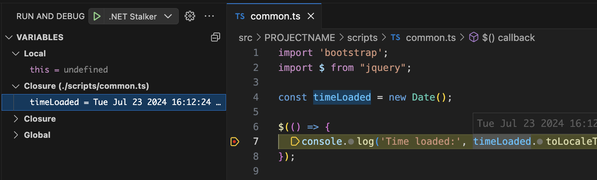

<h1 align="center">
    <p></p>
    <p>C# .NET Stalker Debugger</p>
</h1>
<h3 align="center">All-in-One C# .NET (5+ and Core) and JavaScript/TypeScript Debugger</h3>
<p align="center">Use this debugger, instead of <code>dotnet</code>/<code>coreclr</code>, in launch configurations in <code>launch.json</code>. It provides the same debugging experience plus additional functionality all in a single debug session.</p>
<p align="center"><a href="https://marketplace.visualstudio.com/items?itemName=spencerjames.stalker-debugger"></a></p>

<p align="center">
    <br/>
    <span style="font-size:.85em">.NET Stalker Debugger: VS Code debug console output</span>
</p>

# Primary Features

<p align="center" style="font-size:1.25em">🚫 No need to manually stop, re-attach or restart debuggers or run multiple tasks 🚫</p>

There are three primary features of .NET Stalker Debugger.

1. 🛠️ <b>BUILD</b> — Build and run project
    - Lint JavaScript and TypeScript files
    - Transpile TypeScript to JavaScript for client-side use
    - Build and run the .NET project
2. 🪲 <b>DEBUG</b> — Debug both backend and front-end
    - Attach to the .NET project process for backend debugging
    - Debug with Google Chrome or Mozilla Firefox developer tools for client-side debugging
3. ⌚️ <b>WATCH-RELOAD/REBUILD-REATTACH</b> — Watch for changes
    - Watch TypeScript files to "hot transpile" to JavaScript when needed
    - Watch other client-side files to reload browser on changes
    - Watch .NET project files to perform "hot reloads" when possible
    - Rebuild and re-attach to project's new process when a "hot reload" build is needed

# TL;DR

1. Install this extension
2. Check out the [example C# project](https://github.com/kokoabim/vscode-stalker-debugger/tree/main/CSharpProjectExamples/TotalStalker) for an example of use, specifically:
    - VS Code launch configuration `.NET Stalker` in `.vscode/launch.json`
    - TypeScript, ESLint and Webpack configuration files
3. Set breakpoint in jQuery document-ready function of `src/TotalStalker/scripts/common.ts` (to demonstrate client-side debugging)
4. Set breakpoint in `OnGet()` method of `src/TotalStalker/Pages/Index.cshtml.cs` (to demonstrate backend debugging)
5. Debug with `.NET Stalker` launch configuration 🚀

# 👨🏼‍💻 Use Cases for Developers

All use cases of .NET Stalker Debugger have [all primary features](#primary-features) (Build, Debug and Watch-Reload/Rebuild-Reattach) in a single debug session that is native to Visual Studio Code and its tooling.

### 🔙 Backend Developer

<p align="center">
<br/>
<span style="font-size:.85em">Backend: C#/.NET breakpoint in VS Code</span>
</p>

-   Example Project: C# ASP.NET Web App/API
-   Debug Session:
    -   Debug/breakpoints of C# ASP.NET Web App/API
    -   Watch, re-build and re-attach to project's new process automatically

### 🌕 Full-Stack & 📄 Front-End Developers (Similar Launch Configurations)

<p align="center">
<br/>
<span style="font-size:.85em">Front-end: TypeScript breakpoint in VS Code (though running transpiled as JavaScript on client-side)</span>
</p>

<p align="center">
<br/>
<span style="font-size:.85em">Front-end: JavaScript/TypeScript debug console in VS Code</span>
</p>

-   Example Project: C# ASP.NET Web App/API with client-side HTML/CSS and JavaScript and/or TypeScript
-   Debug Session:
    -   Debug/breakpoints of C# ASP.NET Web App/API
    -   Watch, re-build and re-attach to project's new process automatically
    -   Debug/breakpoints of client-side JavaScript/TypeScript (in Google Chrome or Mozilla Firefox)
    -   Watch and transpile TypeScript to JavaScript (if using TypeScript and Webpack)
    -   Watch and reload browser on front-end changes (HTML/CSS, JavaScript/TypeScript, etc.)

# 🕵 The .NET Stalker Debugger Life-Cycle

<p align="center">
<br/>
<span style="font-size:.85em">.NET Stalker Debugger: VS Code debugger call stack</span>
</p>

## Phases and Tooling

Logical order of phases within the [three primary features](#primary-three-features). Depending on the launch configuration, some phases may not be used.

| #   | Phase     | Feature | Tooling | Description                                                                           |
| --- | --------- | ------- | ------- | ------------------------------------------------------------------------------------- |
| 1   | PreBuild  | 🛠️      | eslint  | Lint JavaScript and TypeScript files                                                  |
| 2   | PreBuild  | 🛠️      | webpack | Transpile TypeScript to JavaScript for client-side use                                |
| 3   | Continual | ⌚️     | webpack | Watch TypeScript files to "hot transpile" to JavaScript when needed                   |
| 4   | Build     | 🛠️      | dotnet  | Build and run the .NET project                                                        |
| 5   | Debug     | 🪲      | vscode  | Attach to the .NET project process for backend debugging                              |
| 6   | Debug     | 🪲      | browser | Debug with Google Chrome or Mozilla Firefox developer tools for client-side debugging |
| 7   | Continual | ⌚️     | dotnet  | Watch .NET project files to perform "hot reloads" when possible                       |
| 8   | On-Demand | ⌚️     | vscode  | Rebuild and re-attach to project's new process when a "hot reload" build is needed    |

# Requirements

### Supported OS's (at least tested on)

Works on modern versions of linux (Ubuntu), macOS and Windows, where the requirements can be installed.

### Requirements

-   .NET SDK 6.0 or later
-   Visual Studio Code 1.96.0 or later
-   Visual Studio Code [C#](https://marketplace.visualstudio.com/items?itemName=ms-dotnettools.csharp) and [C# Dev Kit](https://marketplace.visualstudio.com/items?itemName=ms-dotnettools.csdevkit) extensions

### Requirements for Client-Side Debugging

-   Node.js and NPM
-   Google Chrome and/or Mozilla Firefox
    -   If using Mozilla Firefox:
        -   Use Firefox [Developer Edition](https://www.mozilla.org/en-US/firefox/developer/)
        -   Visual Studio Code [Debugger for Firefox](https://marketplace.visualstudio.com/items?itemName=firefox-devtools.vscode-firefox-debug) extension

Note: Support for Microsoft Edge will come in a later release.

# Launch Configurations

<p align="center">
<br/>
<span style="font-size:.85em">Launch configuration snippets available in <code>launch.json</code></span>
</p>

When adding/modifying a launch configuration in `launch.json`, after setting `type` to `stalker` and `request` to `launch`, VS Code IntelliSense will assist in providing the necessary properties and values.

## Properties

| Property         | Type          | Description                                                                                                                                                                                                                       | Required | Default                 | Defined Values                                              |
| ---------------- | ------------- | --------------------------------------------------------------------------------------------------------------------------------------------------------------------------------------------------------------------------------- | -------- | ----------------------- | ----------------------------------------------------------- |
| `name`           | `string`      | Name of the launch configuration.                                                                                                                                                                                                 | Yes      |                         |                                                             |
| `type`           | `string`      | Type of the launch configuration. Must be `stalker`.                                                                                                                                                                              | Yes      |                         |                                                             |
| `request`        | `string`      | Request type of the launch configuration. Must be `launch`.                                                                                                                                                                       | Yes      |                         |                                                             |
| `project`        | `string`      | Path to the project file (`.csproj`).                                                                                                                                                                                             | Yes      |                         |                                                             |
| `process`        | `string`      | Path to the project's executable process.                                                                                                                                                                                         | Yes      |                         |                                                             |
| `cwd`            | `string`      | Current working directory.                                                                                                                                                                                                        |          | `${workspaceFolder}`    |                                                             |
| `url`            | `string`      | URL of the project.                                                                                                                                                                                                               |          | `http://localhost:5001` |                                                             |
| `env`            | `{[key]:any}` | Environment variables.                                                                                                                                                                                                            |          | `{}`                    |                                                             |
| `webRoot`        | `string`      | Path to the web root of the project (if debugging with Google Chrome).                                                                                                                                                            |          | `${workspaceFolder}`    |                                                             |
| `console`        | `string`      | Console to use for debugging.                                                                                                                                                                                                     |          | `internalConsole`       | `internalConsole`, `integratedTerminal`, `externalTerminal` |
| `logging`        | `{}`          | Logging to use for debugging.                                                                                                                                                                                                     |          | `{ moduleLoad: false }` |                                                             |
| `vars`           | `{[key]:any}` | Launch configuration variables. For use with other launch configuration properties. Reference only VSCode variables; do not reference other launch configuration variables. Not used directly by the extension for functionality. |          |                         |                                                             |
| `attachOptions`  | see below     | Options for attaching to child process started by .NET Watch.                                                                                                                                                                     |          | `{}`                    |                                                             |
| `buildOptions`   | see below     | Options relating to building.                                                                                                                                                                                                     |          | `{}`                    |                                                             |
| `processOptions` | see below     | Options for child process started by .NET Watch.                                                                                                                                                                                  |          | `{}`                    |                                                             |
| `watchOptions`   | see below     | Options for .NET Watch.                                                                                                                                                                                                           |          | `{}`                    |                                                             |

### Type `attachOptions` Properties

Options for attaching to child process started by .NET Watch.

| Property                | Type          | Description                                                                                                                    | Required | Default                              | Defined Values                                                     |
| ----------------------- | ------------- | ------------------------------------------------------------------------------------------------------------------------------ | -------- | ------------------------------------ | ------------------------------------------------------------------ |
| `action`                | `string`      | Action to take when the child process is initially attached to.                                                                |          | `openExternally`                     | `nothing`, `openExternally`, `debugWithChrome`, `debugWithFirefox` |
| `interval`              | `number`      | Interval in milliseconds to attempt to re-attach to the process after a full hot load build (as well as initially at startup). |          | `500`                                |                                                                    |
| `urlPath`               | `string`      | URL path to open when attaching to the process.                                                                                |          | `""`                                 |                                                                    |
| `taskProperties`        | `{[key]:any}` | Properties for internal the Visual Studio Code attach task.                                                                    |          | `{ logging: { moduleLoad: false } }` |                                                                    |
| `browserTaskProperties` | `{[key]:any}` | Properties for internal the Visual Studio Code browser debug task.                                                             |          | `{}`                                 |                                                                    |

### Type `buildOptions` Properties

Options relating to building.

| Property        | Type      | Description                                                                                                                                                                                                                                                                  | Required | Default | Defined Values |
| --------------- | --------- | ---------------------------------------------------------------------------------------------------------------------------------------------------------------------------------------------------------------------------------------------------------------------------- | -------- | ------- | -------------- |
| `preBuildTasks` | see below | Tasks to run before running .NET Watch (which builds and runs the project). Tasks are run in order. By default, tasks are not treated as background tasks and are waited for before continuing. Use `isBackground` and `waitFor` change behavior. Default is an empty array. |          | `[]`    |                |

### Type `preBuildTask` Properties

| Property                | Type      | Description                                                              | Required | Default | Defined Values |
| ----------------------- | --------- | ------------------------------------------------------------------------ | -------- | ------- | -------------- |
| `name`                  | `string`  | Name of the task to run.                                                 | Yes      |         |                |
| `commandLine`           | `string`  | Command line to run.                                                     | Yes      |         |                |
| `isBackground`          | `boolean` | Indicate whether the task is a background task or not.                   |          | `false` |                |
| `waitFor`               | `boolean` | Indicate whether to wait for the task to complete before continuing.     |          | `true`  |                |
| `failOnNonZeroExitCode` | `boolean` | Indicate whether to fail the build if the task has a non-zero exit code. |          | `true`  |                |
| `problemMatcher`        | `string`  | Problem matcher to use for the task.                                     |          |         |                |

### Type `processOptions` Properties

Options for child process started by .NET Watch.

| Property                | Type     | Description                                                                                                                            | Required | Default | Defined Values |
| ----------------------- | -------- | -------------------------------------------------------------------------------------------------------------------------------------- | -------- | ------- | -------------- |
| `args`                  | `array`  | Arguments passed to the child process.                                                                                                 |          | `[]`    |                |
| `launchSettingsProfile` | `string` | launch settings profile (in `Properties/launchSettings.json`) to start the child process with. If used, the `url` property is ignored. |          |         |                |

### Type `watchOptions` Properties

Options for .NET Watch.

| Property                | Type      | Description                                                                                                                                                               | Required | Default  | Defined Values |
| ----------------------- | --------- | ------------------------------------------------------------------------------------------------------------------------------------------------------------------------- | -------- | -------- | -------------- |
| `args`                  | `array`   | Arguments passed to .NET Watch.                                                                                                                                           |          | `[]`     |                |
| `disableOptimizations`  | `boolean` | Disable MSBuild optimizations.                                                                                                                                            |          | `false`  |                |
| `doNotLaunchBrowser`    | `boolean` | Do not launch the browser if the `processOptions.launchSettingsProfile` property is used and is configured to do so. Ignored if `processOptions.action` is not `nothing`. |          | `false`  |                |
| `doNotRefreshBrowser`   | `boolean` | "Do not refresh the browser when changes are detected.                                                                                                                    |          | `false`  |                |
| `dotnet`                | `string`  | Path to the dotnet executable.                                                                                                                                            |          | `dotnet` |                |
| `interval`              | `number`  | Interval in milliseconds to check if child process has restarted, after a hot load build, to re-attach to it.                                                             |          | `1000`   |                |
| `noEmojis`              | `boolean` | Disable emojis in the console output.                                                                                                                                     |          | `false`  |                |
| `usePollingFileWatcher` | `boolean` | Use polling file watcher. This is required for some file systems, such as network shares, Docker mounted volumes, and other virtual file systems.                         |          | `false`  |                |
| `verbose`               | `boolean` | Enable verbose logging for .NET Watch.                                                                                                                                    |          | `false`  |                |

If the browser is not refreshing on detected changes, see the `usePollingFileWatcher` property and [dotnet-watch browser refresh](https://learn.microsoft.com/en-us/aspnet/core/tutorials/dotnet-watch#browser-refresh).

See [dotnet-watch configuration](https://learn.microsoft.com/en-us/aspnet/core/tutorials/dotnet-watch#dotnet-watch-configuration) for more information on some of these watch options.

## Examples

### Minimum launch configuration

```json
{
    "name": ".NET Stalker",
    "type": "stalker",
    "request": "launch",
    "project": "${workspaceFolder}/src/MyWebApp/MyWebApp.csproj",
    "process": "${workspaceFolder}/src/MyWebApp/bin/Debug/net9.0/MyWebApp",
    "cwd": "${workspaceFolder}/src/MyWebApp",
    "env": {
        "ASPNETCORE_ENVIRONMENT": "Development"
    }
}
```

### Minimum launch configuration with specific URL and use of variables

```json
{
    "name": ".NET Stalker",
    "type": "stalker",
    "request": "launch",
    "vars": {
        "framework": "net9.0",
        "projectDir": "${workspaceFolder}/src/${var:projectName}",
        "projectName": "MyWebApp"
    },
    "project": "${var:projectDir}/${var:projectName}.csproj",
    "process": "${var:projectDir}/bin/Debug/${var:framework}/${var:projectName}",
    "cwd": "${var:projectDir}",
    "url": "http://localhost:8080",
    "env": {
        "ASPNETCORE_ENVIRONMENT": "Development"
    }
}
```

### Full launch configuration with ESLint, Webpack (watch mode) and Google Chrome (or Mozilla Firefox) client-side debugging

```json
{
    "name": ".NET Stalker (Full)",
    "type": "stalker",
    "request": "launch",
    "vars": {
        "framework": "net9.0",
        "projectDir": "${workspaceFolder}/src/${var:projectName}",
        "projectName": "<PROJECTNAME>"
    },
    "project": "${var:projectDir}/${var:projectName}.csproj",
    "process": "${var:projectDir}/bin/Debug/${var:framework}/${var:projectName}",
    "cwd": "${var:projectDir}",
    "env": {
        "ASPNETCORE_ENVIRONMENT": "Development",
        "NODE_ENV": "development"
    },
    "url": "http://localhost:5001",
    "webRoot": "${var:projectDir}/wwwroot",
    "buildOptions": {
        "preBuildTasks": [
            {
                "name": "ESLint",
                "commandLine": "npx eslint --color ./scripts"
            },
            {
                "name": "Webpack",
                "commandLine": "npx webpack --watch --node-env ${env:NODE_ENV} --mode ${env:NODE_ENV} --devtool source-map --color",
                "isBackground": true,
                "waitFor": false,
                "problemMatcher": "$stalker-webpack-watch"
            }
        ]
    },
    "attachOptions": {
        "action": "debugWithChrome",
        "urlPath": "/swagger"
    }
}
```

Note: Set `attachOptions.action` to `debugWithFirefox` to debug with Mozilla Firefox.

# Client-Side JavaScript/TypeScript Debugging

For .NET Stalker Debugger to support client-side JavaScript/TypeScript debugging (i.e. hit breakpoints within Visual Studio Code), some configuration is needed.

While there are many ways to configure a project for client-side debugging, this section provides an example setup using both ESLint and Webpack. You're free to use any other configuration that suits your needs.

Requirements:

1. Google Chrome
2. Node.js
3. Node package dependencies
4. TypeScript, ESLint and Webpack configuration files
5. .NET Stalker Debugger launch configuration modifications

Note that client-side debugging is not required for .NET Stalker Debugger to work. It is only needed if you want to debug client-side code within Visual Studio Code. Also, use of TypeScript (and Webpack) is not required for client-side debugging, but it is used in this example.

## Google Chrome

See [Google Chrome](https://www.google.com/chrome/) for installation.

## Node.js

See [Node.js](https://nodejs.org/) for installation.

## Node Package Dependencies

In the project directory (i.e. `${workspaceFolder}/src/(projectName)`), run:

```bash
npm i --save-dev @types/bootstrap @types/glob @types/jquery @types/node @typescript-eslint/eslint-plugin @typescript-eslint/parser eslint glob path ts-loader ts-node typescript webpack webpack-cli
npm i --save @popperjs/core bootstrap jquery
```

## TypeScript, ESLint and Webpack Configuration Files

### TypeScript File

An noteworthy values here is `compilerOptions.outDir` which is referenced by the Webpack configuration.

`${workspaceFolder}/src/(projectName)/tsconfig.json`

```json
{
    "compilerOptions": {
        "noEmitOnError": true,
        "noImplicitAny": true,
        "sourceMap": true,
        "outDir": "wwwroot/js",
        "esModuleInterop": true,
        "target": "ESNext",
        "module": "commonjs",
        "allowJs": true,
        "checkJs": true
    },
    "exclude": ["./node_modules/", "./wwwroot/", "./webpack.config.ts"],
    "include": ["./scripts/**/*.ts"],
    "compileOnSave": true
}
```

### ESLint Files

`${workspaceFolder}/src/(projectName)/eslint.config.mjs`

```mjs
import typescriptEslint from "@typescript-eslint/eslint-plugin";
import tsParser from "@typescript-eslint/parser";

export default [
    {
        files: ["**/*.ts"],

        ignores: ["./node_modules/**"],
    },
    {
        plugins: {
            "@typescript-eslint": typescriptEslint,
        },

        languageOptions: {
            parser: tsParser,
            ecmaVersion: 2022,
            sourceType: "module",
        },

        rules: {
            "@typescript-eslint/naming-convention": [
                "warn",
                {
                    selector: "import",
                    format: ["camelCase", "PascalCase"],
                },
            ],
            curly: ["warn", "multi-line"],
            eqeqeq: "warn",
            "no-throw-literal": "warn",
            semi: "warn",
            "no-unused-vars": "warn",
            "no-unreachable": "warn",
            "no-unused-expressions": "warn",
        },
    },
];
```

`${workspaceFolder}/src/(projectName)/.eslintignore`

```plaintext
**/node_modules/*
**/webpack.config.ts
**/wwwroot/js/*
```

### Webpack File

Two noteworthy values here are `entry` and `output.path` which are used to transpile TypeScript files in directory `./script` to JavaScript to the `wwwroot/js` directory.

`${workspaceFolder}/src/(projectName)/webpack.config.ts`

```typescript
import { glob } from "glob";
import { resolve } from "path";
import { Configuration } from "webpack";

const config: Configuration = {
    entry: glob.sync("./scripts/**/*.ts").reduce((entries, path) => {
        const entry = path.replace(/(.*\/)?scripts\//, "").replace(".ts", "");
        path = "./" + path;
        entries[entry] = path;
        return entries;
    }, {} as { [key: string]: string }),
    output: {
        path: resolve(__dirname, "wwwroot/js"),
        filename: "[name].js",
        devtoolModuleFilenameTemplate: "[absolute-resource-path]",
    },
    infrastructureLogging: { level: "log" },
    devtool: "source-map",
    target: "web",
    resolve: {
        extensions: [".ts", ".js"],
    },
    module: {
        rules: [
            {
                test: /\.ts$/,
                use: "ts-loader",
            },
        ],
    },
};

export default config;
```

## Launch Configuration Modifications

Before starting the .NET Stalker Debugger, pre-build tasks are needed to:

1. (Optionally) Run ESLint
2. (Required) Use Webpack to transpile TypeScript files to JavaScript to the `wwwroot/js` directory

**Important:** Pre-build tasks are executed in the order they are defined. Ensure ESLint is run before Webpack.

### Pre-Build Task: ESLint

Editing an existing .NET Stalker Debugger launch configuration, append to root level:

```json
"buildOptions": {
    "preBuildTasks": [
        {
            "name": "ESLint",
            "commandLine": "npx eslint --color ./scripts",
        }
    ]
}
```

### Pre-Build Task: Webpack

Editing an existing .NET Stalker Debugger launch configuration, append to root level:

```json
"env": {
    "NODE_ENV": "development"
}
```

As well as:

```json
"buildOptions": {
    "preBuildTasks": [
        {
            "name": "Webpack",
            "commandLine": "npx webpack --watch --node-env ${env:NODE_ENV} --mode ${env:NODE_ENV} --devtool source-map --color",
            "isBackground": true,
            "waitFor": false,
            "problemMatcher": "$stalker-webpack-watch"
        }
    ]
}
```

To disable the Webpack watch mode (i.e. no "hot transpiles" on file changes), remove `--watch` from the `commandLine` property.

# Extension Settings

There are no global/user extension settings. All settings are configured on a project-level in a `launch.json` file.
